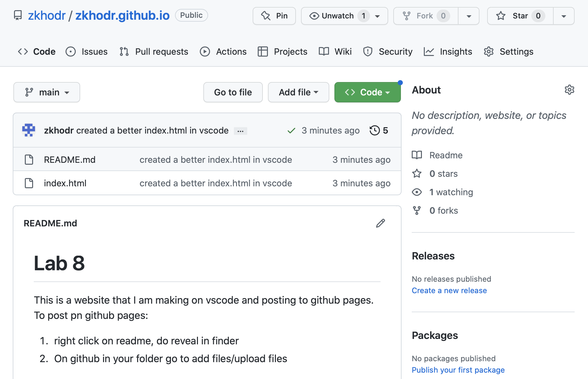

# Lab 8 

This is a website that I am making on vscode and posting to github pages. To post pn github pages: 

1. right click on readme, do reveal in finder 
2. On github in your folder go to add files/upload files

 